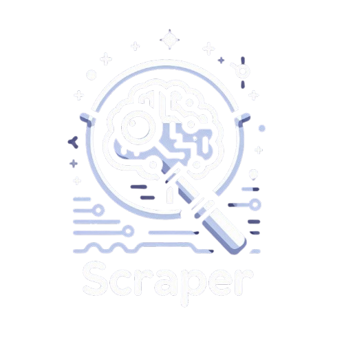

<!-- PROJECT LOGO -->
 

  

<h3 align="center">AI Scraper</h3>

<!-- TABLE OF CONTENTS -->

  
Table of Contents

  <ol>
    <li>
      <a href="#about-the-project">About The Project</a>
      <ul>
        <li><a href="#built-with">Built With</a></li>
      </ul>
    </li>
    <li>
      <a href="#getting-started">Getting Started</a>
      <ul>
        <li><a href="#prerequisites">Prerequisites</a></li>
        <li><a href="#installation">Installation</a></li>
      </ul>
    </li>
    <li><a href="#usage">Usage</a></li>
    <li><a href="#roadmap">Roadmap</a></li>
    <li><a href="#contributing">Contributing</a></li>
    <li><a href="#license">License</a></li>
    <li><a href="#contact">Contact</a></li>
    <li><a href="#acknowledgments">Acknowledgments</a></li>
  </ol>

<!-- ABOUT THE PROJECT -->
## About The Project

This AI scraper application was created by following a guide from <a href="https://www.techwithtim.net/">TechWithTim</a>.

Features:

* Scrape website by URL (if not protected by capcha etc.)
* Define and use LLM of choice (locally installed)
* Define prompt to collect data from scraped content

(<a href="#readme-top">back to top</a>)

### Built With

* [![Python][Python]][Python-url]
* [![Selenium][Selenium]][Selenium-url]
* [![Ollama][Ollama]][Ollama-url]
* [![Streamlit][Streamlit]][Streamlit-url]

(<a href="#readme-top">back to top</a>)

<!-- GETTING STARTED -->
## Getting Started

To get your on scraper up and running follow these simple steps.

### Prerequisites

1. Install [Python](https://www.python.org/downloads/) for your system

2. Update or install the latest [Chrome](https://www.google.com/intl/hu_hu/chrome/) browser

3. Download the latest [Chromedriver](https://googlechromelabs.github.io/chrome-for-testing/#stable) for your system (this repo has the linux64 version)

4. Copy the downloaded Chromedriver to the root directory of the repo

5. On Windows, change the `chrome_driver_path` to `"./chromedriver.exe"` in the `scrape.py` file

6. Install [Ollama](https://ollama.com/download)

7. Download your desired [LLM model](https://github.com/ollama/ollama) - follow the instructions and make sure to choose a model according to your system resources

### Installation

* Swich to the repo directory if you haven't already
* Create a python venv called "ai": `python -m venv ai`
* Activate the venv
  * on Linux/Mac: `source ai/bin/activate`
  * on Windows CMD: `ai\Scripts\activate.bat`
  * on Windows PowerShell: `ai\Scripts\activate.ps1`
* Install dependencies: `python -m pip install -r requirements.txt`

(<a href="#readme-top">back to top</a>)

<!-- USAGE EXAMPLES -->
## Usage

1. Start the app by running: `streamlit run main.py`

2. Enter the URL to scrape (without captcha protection)

3. Enter the prompt to get the data from the scraped DOM

4. To stop the app, simply press `Ctrl + C`

(<a href="#readme-top">back to top</a>)

<!-- ACKNOWLEDGMENTS -->
## Acknowledgments

* [TechWithTim](https://www.techwithtim.net/)
* [Img Shields](https://shields.io)
* [Simple Badges](https://badges.pages.dev/)

(<a href="#readme-top">back to top</a>)

<!-- MARKDOWN LINKS & IMAGES -->

[Python]: https://img.shields.io/badge/Python-3776AB?logo=python&logoColor=fff&style=for-the-badge
[Python-url]: https://www.python.org/
[Selenium]: https://img.shields.io/badge/Selenium-43B02A?logo=selenium&logoColor=fff&style=for-the-badge
[Selenium-url]: https://www.selenium.dev/
[Ollama]: https://img.shields.io/badge/Ollama-000?logo=ollama&logoColor=fff&style=for-the-badge
[Ollama-url]: https://ollama.com/
[Streamlit]: https://img.shields.io/badge/Streamlit-FF4B4B?logo=streamlit&logoColor=fff&style=for-the-badge
[Streamlit-url]: https://streamlit.io/
